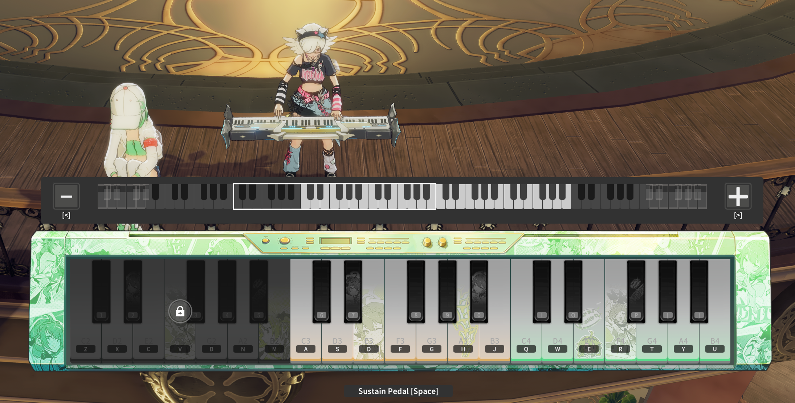

# Blue Protocol MIDI Bard Player




A plug-and-play desktop application designed to read standard MIDI (`.mid`) files and automatically transcribe them into precise keyboard strokes for Blue Protocol Star Resonance (BPSR) instrument playback.

## Features

- **High-Accuracy Timing:** Uses Python's internal performance counters to guarantee millisecond-perfect playback without desyncing.
- **Hardware-Level Simulation:** Bypasses game input-blocking by injecting inputs directly at the OS level using Windows API (`ctypes.windll.user32.SendInput`).
- **Smart Octave Shifting:** Automatically maps notes to the optimal octave shift (`L Shift` or `L Ctrl`) and minimizes unnecessary toggle presses to ensure smooth chord playback.
- **Sustain Support:** Fully supports MIDI Sustain Pedal events (CC64), toggling the in-game `[Space]` bar.
- **Modern GUI:** Built with `customtkinter` for a beautiful dark-mode interface.
- **Channel Selector:** Mute or solo specific tracks inside a MIDI file (e.g., mute the drum track).

## Setup & Installation

You have two options to run this application:

### Option 1: Plug-and-Play Executable (Recommended)
1. Go to the **Releases** page on GitHub.
2. Download the `BPSR_MIDI_Player.exe` file.
3. Run the executable. No Python installation required!

### Option 2: Run from Source
1. Clone this repository.
2. Install Python 3.8+
3. Install the dependencies:
   ```bash
   pip install -r requirements.txt
   ```
   *(Dependencies: `mido`, `customtkinter`)*
4. Run the app:
   ```bash
   python main.py
   ```

## How to Use

1. Launch the application.
2. Click **Load MIDI** and select your `.mid` file.
3. Uncheck any channels/tracks you don't want to play.
4. **Important:** Switch to Blue Protocol, pull out your instrument, and ensure the game is in active focus!
5. Alt-tab to the player, click **Play**, and quickly click back into the game window.

> **Warning:** Because the app sends raw hardware keystrokes, it will type exactly where your cursor is focused. Do not leave a chat box open while playing!

## Keybindings Map

The app assumes the default BPSR keybindings:
- **Base Range:** C3 to B5
- **White Keys:** Z X C V B N M (C3-B3), A S D F G H J (C4-B4), Q W E R T Y U (C5-B5)
- **Black Keys:** 1 2 3 4 5, 6 7 8 9 0, I O P [ ]
- **High Octave:** L Shift
- **Low Octave:** L Ctrl
- **Sustain:** Space

*To change bindings, edit `config.py` and run from source.*
